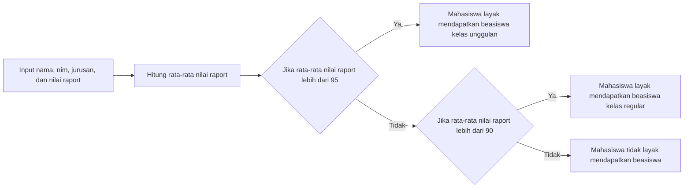

### JOBSHEET 3 - DASAR PEMROGRAMMAN
<p align="center">
    
</p>

#### Dibuat dan disusun oleh
| Variabel | Nilai               |
|----------|---------------------|
| Nama     | Naufal Reky Ardhana |
| NIM      | 4.33.22.0.21        |
| Kelas    | TI-1A               |

**PROGRAM STUDI TEKNIK INFORMATIKA JURUSAN TEKNIK ELEKTRO POLITEKNIK NEGERI SEMARANG - 2022**

#### Tabel Isi
  * [Tujuan Praktikum](#tujuan-praktikum)
  * [Alat dan Bahan](#alat-dan-bahan)
  * [BAB 1 - Dasar Teori](#bab-1---dasar-teori)
    * [Struktur Kontrol](#struktur-kontrol)
    * [1.2. Struktur Percabangan](#12-struktur-percabangan)
    * [1.3. Struktur Perulangan](#13-struktur-perulangan)
  * [BAB 2 - Praktikum](#bab-2---praktikum)
    * [2.1.1. Struktur Percabangan `if-else`](#211-struktur-percabangan-if-else)
    * [2.1.2. Struktur Perulangan](#212-struktur-perulangan)
    * [2.2.3. Struktur Percabangan Lanjutan](#223-struktur-percabangan-lanjutan)
    * [2.2.4. Contoh Kasus](#224-contoh-kasus)
    * [2.2.5. Latihan](#225-latihan)
    * [2.2.6. Penyelesaian](#226-penyelesaian)
  * [BAB 3 - Kesimpulan](#bab-3---kesimpulan)
#### Tujuan Praktikum
- Mahasiswa mampu memahami dan menerapkan konsep dasar pemrograman
- Mahasiswa dapat menggunakan perintah struktur kontrol Python
- Mahasiswa dapat menggunakan perintah perulangan Python

#### Alat dan Bahan
- Laptop
- Python `3.10.0`
- PyCharm `2020.3.3`
- Git `2.30.0`

<br>

#### BAB 1 - Dasar Teori

##### Struktur Kontrol
Struktur kontrol adalah suatu perintah yang digunakan untuk mengatur alur program. Struktur kontrol terdiri dari dua jenis, yaitu struktur kontrol perulangan dan struktur kontrol percabangan.
##### 1.2. Struktur Percabangan
Struktur kontrol percabangan adalah suatu perintah yang digunakan untuk mengatur alur program berdasarkan kondisi tertentu. Struktur kontrol percabangan terdiri dari dua jenis, yaitu struktur kontrol percabangan `if` dan struktur kontrol percabangan `if-else`.
##### 1.3. Struktur Perulangan
Struktur perulangan adalah suatu perintah yang digunakan untuk mengulang suatu perintah tertentu. Struktur perulangan terdiri dari dua jenis, yaitu struktur perulangan `for` dan struktur perulangan `while`.

<br>

#### BAB 2 - Praktikum
##### 2.1.1. Struktur Percabangan `if-else`
```python
# input umur
umur = int(input("Masukkan umur: "))

# input minimal umur
minimal_umur = 18

# cek apakah umur lebih besar atau sama dengan minimal umur
if umur >= minimal_umur:
    
    # jika ya, maka tampilkan pesan
    print("Anda sudah cukup umur untuk membuat SIM")
    
# jika tidak, maka tampilkan pesan
else:
    print("Anda belum cukup umur untuk membuat SIM")
```


##### 2.1.2. Struktur Perulangan
```python
# membuat segitiga terbalik
# gunakan reversed() untuk membalikkan angka
for i in reversed(range(1, 10)):
    
    # cetak karakter * sebanyak i
    print("*" * i)
```


##### 2.2.3 Struktur Percabangan Lanjutan
```python
# program pembandingan 3 bilangan
# input bilangan 1
bilangan_1 = int(input("Masukkan bilangan 1: "))

# input bilangan 2
bilangan_2 = int(input("Masukkan bilangan 2: "))

# input bilangan 3
bilangan_3 = int(input("Masukkan bilangan 3: "))

# cek apakah bilangan 1 lebih besar dari bilangan 2
if bilangan_1 > bilangan_2:
    
    # jika ya, maka cek apakah bilangan 1 lebih besar dari bilangan 3
    if bilangan_1 > bilangan_3:
        
        # jika ya, maka tampilkan bilangan 1
        print(f"Bilangan 1 ({bilangan_1}) lebih besar dari bilangan 2 ({bilangan_2}) dan bilangan 3 ({bilangan_3})")
    
    # jika tidak, maka tampilkan bilangan 3
    else:
        print(f"Bilangan 3 ({bilangan_3}) lebih besar dari bilangan 1 ({bilangan_1}) dan bilangan 2 ({bilangan_2})")

# jika tidak, maka cek apakah bilangan 2 lebih besar dari bilangan 3
elif bilangan_2 > bilangan_3:
    
    # jika ya, maka tampilkan bilangan 2
    print(f"Bilangan 2 ({bilangan_2}) lebih besar dari bilangan 1 ({bilangan_1}) dan bilangan 3 ({bilangan_3})")

# jika tidak, maka tampilkan bilangan 3
else:
    print(f"Bilangan 3 ({bilangan_3}) lebih besar dari bilangan 1 ({bilangan_1}) dan bilangan 2 ({bilangan_2})")

```

##### 2.2.4. Contoh Kasus
```python
# import library sqlite3
import sqlite3

# fungsi tambah data
def tambah_mahasiswa():
    # buat variabel untuk menyimpan biodata mahasiswa-mahasiswa
    mahasiswa = []
    
    # input biodata mahasiswa
    # input nama
    nama = input("Masukkan nama: ")
    
    # input nim
    nim = input("Masukkan nim: ")
    
    # input jurusan
    jurusan = input("Masukkan jurusan: ")
    
    # input angkatan
    angkatan = input("Masukkan angkatan: ")
    
    # tambahkan biodata mahasiswa ke dalam variabel mahasiswa
    mahasiswa.append({
        "nama": nama,
        "nim": nim,
        "jurusan": jurusan,
        "angkatan": angkatan
    })

    # simpan data-data mahasiswa ke database sqlite
    # buka koneksi ke database
    database_mahasiswa = sqlite3.connect("mahasiswa.db")
    # buat tabel mahasiswa, jika belum ada maka buat, jika sudah ada maka abaikan
    database_mahasiswa.execute("CREATE TABLE IF NOT EXISTS mahasiswa (nama TEXT, nim TEXT, jurusan TEXT, angkatan TEXT)")
    # simpan data mahasiswa ke database
    database_mahasiswa.execute("INSERT INTO mahasiswa VALUES (?, ?, ?, ?)", (nama, nim, jurusan, angkatan))
    # simpan perubahan
    database_mahasiswa.commit()
    # tutup koneksi ke database
    database_mahasiswa.close()
    # tampilkan pesan
    print('Data berhasil disimpan')

# fungsi hapus data
def hapus_mahasiswa():
    # input nim mahasiswa yang akan dihapus
    nim = input("Masukkan nim: ")
    
    # hapus data mahasiswa dari database
    # buka koneksi ke database
    database_mahasiswa = sqlite3.connect("mahasiswa.db")
    # hapus data mahasiswa dari database
    database_mahasiswa.execute("DELETE FROM mahasiswa WHERE nim = ?", (nim,))
    # cek apakah data sudah terhapus
    if database_mahasiswa.total_changes > 0:
        # simpan perubahan
        database_mahasiswa.commit()
        # tampilkan pesan
        print("Data berhasil dihapus")
    # jika tidak, maka tampilkan pesan
    else:
        print("Data tidak ditemukan")
    # tutup koneksi ke database
    database_mahasiswa.close()

# fungsi tampilkan data
def tampilkan_mahasiswa():
    # buka koneksi ke database
    database_mahasiswa = sqlite3.connect("mahasiswa.db")
    # ambil data mahasiswa dari database
    data_mahasiswa = database_mahasiswa.execute("SELECT * FROM mahasiswa")
    # tampilkan data mahasiswa dengan tabel
    print("Nama\tNIM\tJurusan\tAngkatan")
    # tampilkan data mahasiswa
    for mahasiswa in data_mahasiswa:
        print(f"{mahasiswa[0]}\t{mahasiswa[1]}\t{mahasiswa[2]}\t{mahasiswa[3]}")
    # tutup koneksi ke database
    database_mahasiswa.close()

# fungsi menu
def menu():
    # tampilkan menu dengan perulangan tak hingga
    while True:
        # tampilkan menu
        print("Menu:")
        print("1. Tambah data mahasiswa")
        print("2. Hapus data mahasiswa")
        print("3. Tampilkan data mahasiswa")
        print("4. Keluar")
        # input pilihan menu
        pilihan = input("Masukkan pilihan: ")
        
        # cek apakah pilihan menu adalah 1
        if pilihan == "1":
            # jika ya, maka jalankan fungsi tambah_mahasiswa()
            tambah_mahasiswa()
        
        # cek apakah pilihan menu adalah 2
        elif pilihan == "2":
            # jika ya, maka jalankan fungsi hapus_mahasiswa()
            hapus_mahasiswa()
        
        # cek apakah pilihan menu adalah 3
        elif pilihan == "3":
            # jika ya, maka jalankan fungsi tampilkan_mahasiswa()
            tampilkan_mahasiswa()
        
        # cek apakah pilihan menu adalah 4
        elif pilihan == "4":
            # jika ya, maka keluar dari perulangan
            break
        
        # jika tidak, maka tampilkan pesan
        else:
            print("Pilihan tidak ditemukan")

# jalankan fungsi menu
menu()
```

##### 2.2.5. Latihan
Buatlah program untuk menentukan **mahasiswa baru** mana yang layak mendapatkan beasiswa. 
Program tersebut memiliki 4 input yaitu nama, nim, jurusan, dan nilai raport mata pelajaran ujian SMA
- Jika nilai rata-rata raport lebih dari 95, maka mahasiswa tersebut layak mendapatkan beasiswa kelas unggulan
- Jika nilai rata-rata raport lebih dari 90, maka mahasiswa tersebut layak mendapatkan beasiswa kelas regular

##### 2.2.6. Penyelesaian
Algoritma
```
1. Mulai
2. Input nama, nim, jurusan, dan nilai raport
3. Hitung rata-rata nilai raport
4. Jika rata-rata nilai raport lebih dari 95, maka tampilkan "Mahasiswa layak mendapatkan beasiswa kelas unggulan"
5. Jika rata-rata nilai raport lebih dari 90, maka tampilkan "Mahasiswa layak mendapatkan beasiswa kelas regular"
6. Lain jika tampilkan "Mahasiswa tidak layak mendapatkan beasiswa"
7. Selesai
```
Flowchart

Kode program
```python
# input nama, nim, jurusan, dan nilai raport
nama = input("Masukkan nama: ")
nim = input("Masukkan nim: ")
jurusan = input("Masukkan jurusan: ")

# input nilai mata pelajaran ujian SMA
nilai_bahasa_indonesia = int(input("Masukkan nilai ahasa Indonesia: "))
nilai_bahasa_inggris = int(input("Masukkan nilai bahasa Inggris: "))
nilai_matematika = int(input("Masukkan nilai matematika: "))
nilai_fisika = int(input("Masukkan nilai fisika: "))
nilai_kimia = int(input("Masukkan nilai kimia: "))
nilai_biologi = int(input("Masukkan nilai biologi: "))

# hitung rata-rata nilai raport
rata_rata_nilai_raport = (nilai_bahasa_indonesia + nilai_bahasa_inggris + nilai_matematika + nilai_fisika + nilai_kimia + nilai_biologi) / 6

# cek apakah rata-rata nilai raport lebih dari 95
if rata_rata_nilai_raport > 95:
    # jika ya, maka tampilkan pesan
    print("Mahasiswa layak mendapatkan beasiswa kelas unggulan")
# cek apakah rata-rata nilai raport lebih dari 90
elif rata_rata_nilai_raport > 90:
    # jika ya, maka tampilkan pesan
    print("Mahasiswa layak mendapatkan beasiswa kelas regular")
# jika tidak, maka tampilkan pesan
else:
    print("Mahasiswa tidak layak mendapatkan beasiswa")
```

#### BAB 3 - Kesimpulan
Dengan dilaksaanakannya praktikum ini, dapat disimpulkan bahwa:
- Python adalah bahasa pemrograman yang mudah dipelajari dan memiliki sintaks yang sederhana
- Python dapat digunakan untuk membuat program sederhana seperti program kalkulator, program penghitung luas dan keliling bangun datar, dan program sistem informasi mahasiswa
- Python dapat digunakan untuk membuat program yang lebih kompleks seperti program sistem informasi mahasiswa dengan fitur tambah, hapus, dan tampilkan data mahasiswa